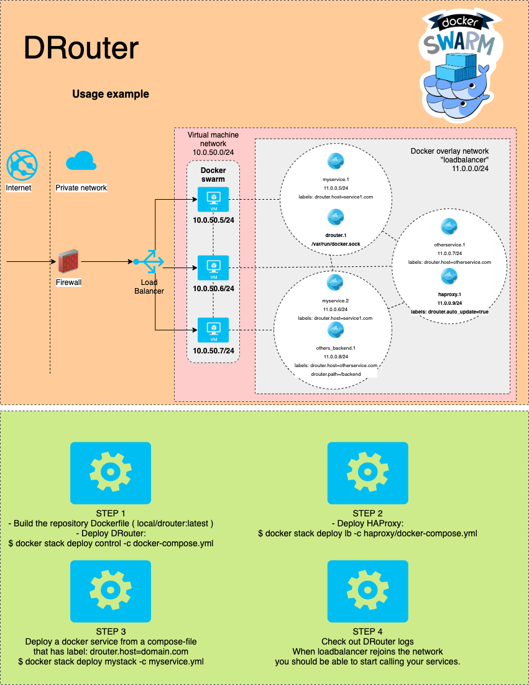

# DRouter

Create HAProxy configurations automatically based on the current status of your Docker Swarm.

DRouter will check your service labels and configure HAProxy according to them.

## Prerequisites

- Docker Swarm configured

## DRouter example photo




## Dependencies

- Docker Swarm (Supported API Version 1.40+)
- HAProxy 2.1+ docker image (for example from docker hub)

## Necessary for domain based routing

- Domain records (either)
  - Real ones pointed to your environment public IP or
  - Fake ones (point for example domain.com to 127.0.0.1 in your /etc/hosts)

The easiest way to run DRouter is to build and deploy its Docker image.
Otherwise you will also need:

- Python 3.7x
- make

## How to run DRouter?

Create virtual network for DRouter. (Default: loadbalancer)
Start DRouter (either in container or normally)

If necessary pass DROUTER_DOCKER_VNET to drouter at startup where that environment variable contains the Docker virtual network name.


### Using the DRouter in docker container

To run DRouter in a container just build this repository to a Docker image and deploy from docker-compose.yml in the repository root.


Shortcut to all this:
```bash
make docker
make lbnet
make deploy-all
```


### Using DRouter outside Docker container

- Install dependencies mentioned in "Prerequisites".

shortcut:
```bash
make lbnet
cd src
./drouter.py
cd ..
make deploy-haproxy
```

## Adding a swarm service for DRouter

Deploy your swarm service with labels (Example below):

Template:
```yaml
version: '3.1'

services:

  # Service template
  example_service:
    image: myregistry/myrepository:latest
    environment:
      TZ: Europe/Helsinki
    ports:
      - "7018:80"
    deploy:
      labels: [drouter.host=domain.com, drouter.path=/, drouter.port=80]
      mode: replicated
      replicas: 1
      update_config:
        parallelism: 1
        delay: 60s
        failure_action: rollback
      restart_policy:
        max_attempts: 3
        condition: on-failure
    networks:
      - loadbalancer

networks:
  loadbalancer:
    external: true

```

Command to deploy:
```bash
docker stack deploy mystack -c myservicefile.yml --with-registry-auth
```

## Accepted drouter labels for a service
```bash
# Mandatory (when added, DRouter condfigures HAProxy for this service)
drouter.host=domain.com
# Optional. Mandatory if the service has multiple port assignments
drouter.port=80
# Optional. Must be used at the same time with 'drouter.host'. If the request to a domain has this path then this service will be used.
drouter.path=/some_path
# Optional. If you have TLS/SSL enabled in your backend but you are doing TLS/SSL termination in HAProxy instead of the service container then set this to 'noverify'
drouter.ssl=noverify
# Optional. If you have TLS/SSL enabled in your backend set this to 'verify'.
drouter.ssl=verify
# Optional. If you want to replace (cut) path, use this. It will make requests to HAProxy frontend to path '/somepath' go to '/' in the HAProxy backend(s).
drouter.cut_path
```

## Accepted drouter labels for HAProxy
```bash
# Mandatory. This will assign a HAProxy service to DRouter.
drouter.auto_update=true
```

## Environment variables for DRouter
```bash
## Variables with default values

# Define loglevel (default: INFO)
DROUTER_LOGLEVEL="INFO"
# Define docker socket location on the filesystem
DROUTER_DOCKER_SOCKET="/var/run/docker.sock"
# Define haproxy config folder
HAPROXY_CONFIG_PATH="../haproxy"
# Define which docker virtualnetwork DRouter should monitor
DROUTER_DOCKER_VNET="loadbalancer"
# Default template is 'haproxy.cfg.template-http' under haproxy/
# Replace with full (absolute) path
HAPROXY_TEMPLATE="/absolute/path/to/haproxy.cfg.template-http"
```